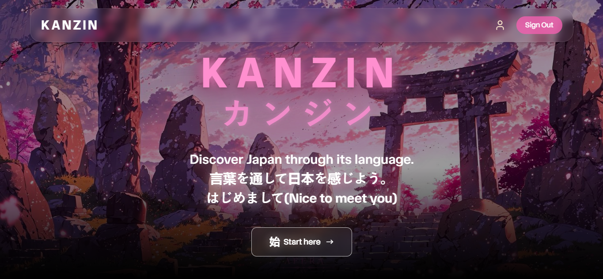
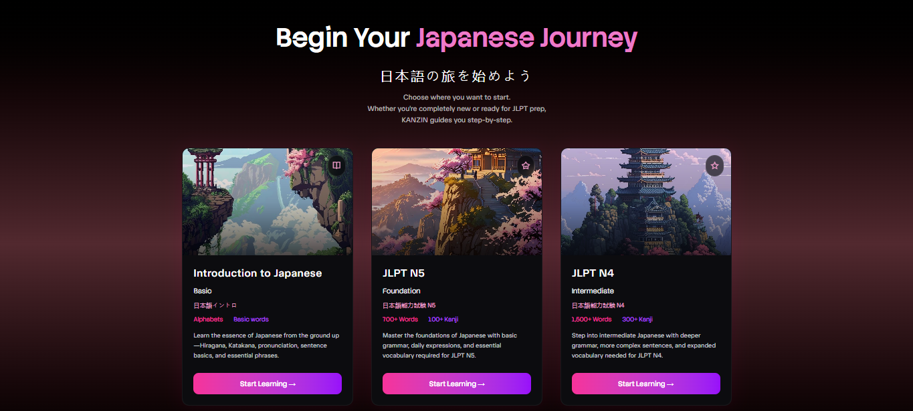
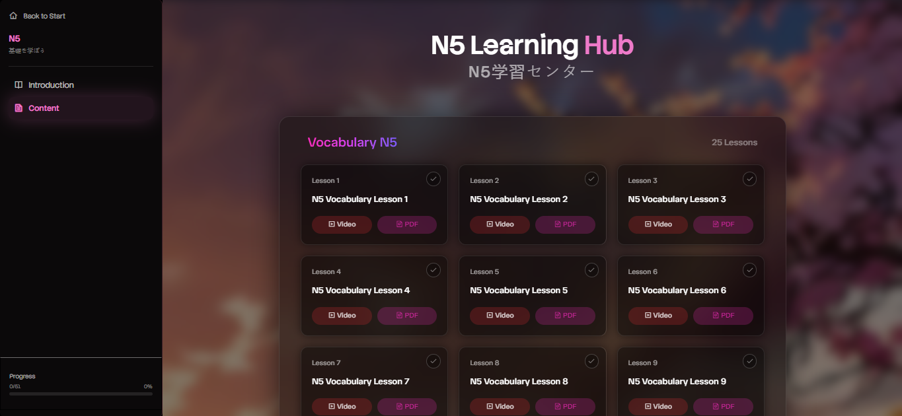
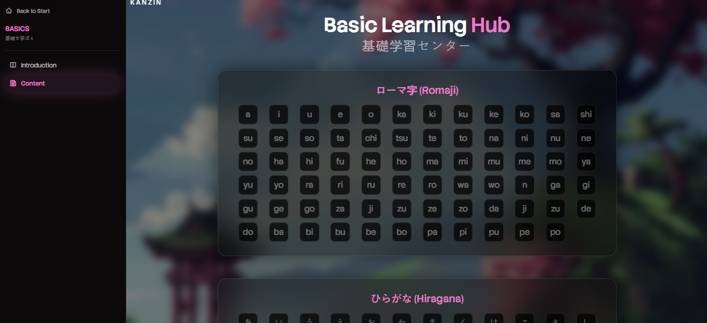

# 🇯🇵 KANZIN - Japanese Language Learning Platform

KANZIN is a modern, full-stack Japanese language learning platform designed to provide a structured and engaging path for students. From mastering the basics (Hiragana, Katakana, Romaji) to preparing for JLPT N5 and N4 certifications, KANZIN offers a rich multimedia experience.



## 🚀 Features

- **🎓 Structured Learning Paths**: Comprehensive modules for Basics, JLPT N5, and JLPT N4.
- **🎥 Multimedia Content**: Integrated video lessons and PDF resources for every lesson.
- **🔡 Interactive Charts**: Dynamic Romaji and Hiragana charts for foundational learning.
- **🔐 Secure Authentication**: JWT-based user authentication system.
- **🎨 Premium UI/UX**: Dark-themed, Japanese-inspired design with smooth animations using Framer Motion.
- **📱 Fully Responsive**: Seamless experience across desktop and mobile devices.

---

## 📸 Screenshots

| Landing Page | Learning Hub |
| :---: | :---: |
|  |  |

| Basics Hub | Vocabulary Lesson |
| :---: | :---: |
|  |  |

---

## 🛠️ Tech Stack

**Frontend:**
- React.js (Vite)
- Tailwind CSS
- Framer Motion (Animations)
- Lucide React & Remixicon (Icons)
- React Router DOM (Navigation)

**Backend:**
- Node.js & Express.js
- MongoDB & Mongoose (Database)
- JSON Web Tokens (Auth)
- Bcrypt (Security)

---

## 📁 File Structure

```text
kanzin/
├── backend/                # Express.js Server
│   ├── config/             # DB Connection Logic
│   ├── controllers/        # API Request Handlers
│   ├── models/             # Mongoose Data Schemas
│   ├── middleware/         # Auth & Error Middleware
│   ├── routes/             # API Endpoints
│   └── server.js           # Server Entry Point
├── frontend/               # React Application
│   ├── src/
│   │   ├── components/     # UI Components
│   │   ├── pages/          # Main Screen Views
│   │   ├── context/        # Global State Management
│   │   ├── assets/         # Images & Styles
│   │   └── utility/        # Helper Functions
│   ├── public/             # Static Assets
│   └── vite.config.js      # Vite Configuration
└── README.md
```

---

## ⚙️ Development Setup

Follow these steps to run KANZIN locally on your machine.

### 1. Prerequisites
- Node.js installed
- MongoDB Atlas account or local MongoDB instance

### 2. Clone the Repository
```bash
git clone https://github.com/ggoswami777/KANZIN.git
cd KANZIN
```

### 3. Backend Setup
1. Navigate to the backend directory:
   ```bash
   cd backend
   ```
2. Install dependencies:
   ```bash
   npm install
   ```
3. Create a `.env` file and add your credentials:
   ```env
   DB_URL=your_mongodb_uri
   PORT=3001
   JWT_SECRET=your_secret_key
   ```
4. Start the server:
   ```bash
   npm run server
   ```

### 4. Frontend Setup
1. Navigate to the frontend directory:
   ```bash
   cd ../frontend
   ```
2. Install dependencies:
   ```bash
   npm install
   ```
3. Create a `.env` file:
   ```env
   VITE_BACKEND_URL=http://localhost:3001
   ```
4. Start the development server:
   ```bash
   npm run dev
   ```

---

## 👨‍💻 Internship Showcase
This project demonstrates:
- **Full-stack proficiency** (MERN Stack).
- **Responsive design principles**.
- **Modern frontend state management**.
- **Secure API development**.
- **Clean and modular code architecture**.

---

## 📄 License
This project is for educational purposes as part of a learning journey.

---

*Made with ❤️ for Japanese language enthusiasts.*
